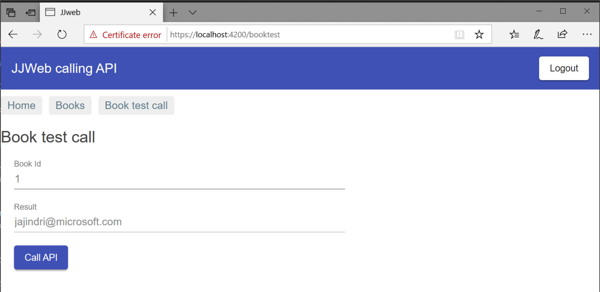

# JJ AngularWeb using Angular calling back-end API with Azure API management

SinglePage Angular web application calling back-end rest API published with API management. Backend API is secured using bearer tokens from Azure Active Directory .

**Design for development**:

- all API services will be published with public IP
- API services published with Azure API Management with public IP

**Design for production**:

- all API services are deployed into virtual network
- API services publish with Azure API Management connected to virtual network

 Why use Azure API management - [Direct communication vs API management](https://docs.microsoft.com/en-us/dotnet/standard/microservices-architecture/architect-microservice-container-applications/direct-client-to-microservice-communication-versus-the-api-gateway-pattern)

- [Protect your API](https://docs.microsoft.com/en-us/azure/api-management/transform-api)
- [Combine with Azure Application Gateway](https://docs.microsoft.com/en-us/azure/api-management/api-management-howto-integrate-internal-vnet-appgateway)

*If you will not use API management, you have to implement security checks on your API services directly.*

**TODO: Next steps**:

- Host API in Docker using Azure Mesh

## Create frontend web

### Create Angular project with Visual Studio Code

I created SinglePage Angular (SPA) web project

How to create new Angular project (with routing) - [Using Angular in Visual Studio Code](https://code.visualstudio.com/docs/nodejs/angular-tutorial)

Tutorial for Angular - [Angular Tutorial](https://angular.io/tutorial/toh-pt0)

Use Material Design - [Angular Material](https://material.angular.io/guide/getting-started)

Run web on localhost, open browser with http://localhost:4200

```bash
cd jjweb
ng serve --open
```

### Add Azure Active Directory to Angular web project

Make sure you have your Azure Active Directory, my is jjdev.onmicrosoft.com

Add Azure Active Directory Sing-in - [Angular use ADAL](https://docs.microsoft.com/en-us/azure/active-directory/develop/quickstart-v1-angularjs-spa)

Example for Angular6 - [Adal-Angular6](https://github.com/benbaran/adal-angular6-example)

Steps to configure Azure Active Directory

1. Add App registration - type https://localhost:42000/
2. Change manifest to oauth2AllowImplicitFlow: true
3. Grant permissions for application

```bash
npm install --save adal-angular4
```

Change source code

1. Change your tenant and clientId in environment settings - yourdomain.onmicrosoft.com and applicationId

Run web on HTTPS localhost (required for claim based auth), open browser with https://localhost:4200

```bash
cd jjweb
ng serve --ssl --open
```

Open browser and check JWT (JSON Web Token) token after successful sign-in. Decode token with [jwt.io](https://jwt.io/).

### Use Authorization to call API service

Code is adding Authorization header with JWT token.

```js
    const httpHeaders = new HttpHeaders()
      .set('Content-Type', 'application/json')      
      .set('Authorization', 'Bearer ' + adalService.userInfo.token); 
```

## Create API backend

I prepared two options how to create API backend

1. Using platform service Azure API App (Web App) - easier to deploy
2. Using microservice cluster Azure ServiceFabric - more complex to create cluster but with lof of advantages from deployment perspective

### Create API project with Visual Studio hosted in Azure Web App

I created DotNet Core API project jjapi and published to Azure API App.

How to add Swagger - [NSwag](https://docs.microsoft.com/en-us/aspnet/core/tutorials/getting-started-with-nswag?view=aspnetcore-2.1&tabs=visual-studio%2Cvisual-studio-xml)

Configure Azure API App (Web App)

1. Swagger link must be updated on API App - API Definition blade - type https://jjapiapp.azurewebsites.net/swagger/v1/swagger.json
2. You will get this API URL: https://jjapiapp.azurewebsites.net/api/books
3. Update CORS url on WebApp based on your web client jjweb, like http://localhost:4200
4. Update SPA project with this url, file main.ts

### Create API project with Visual Studio hosted in Azure ServiceFabric

I created Stateless ASP.Net Core API **project jjapisf with API books** and published to Azure ServiceFabric jjsf.westeurope.cloudapp.azure.com

[Hosting ASP.Net Core in ServiceFabric](https://docs.microsoft.com/en-us/azure/service-fabric/service-fabric-reliable-services-communication-aspnetcore)

Warning: now using Kestrel, limited for multiple services running on same port.

Next I created **second API service called jjapisf2 with API orders**

If you want to use port sharing, you have to use HttpSys listener - [Using unique service URLs](https://docs.microsoft.com/en-us/azure/service-fabric/service-fabric-reliable-services-communication-aspnetcore#using-unique-service-urls)

- add nuget package Microsoft.ServiceFabric.AspNetCore.HttpSys
- change in code Kestrel to HttpSysCommunicationListener
- add your url, like jjapisf1

**Configure Azure ServiceFabic**

1. Create with published ports 80, 443
2. Import PFX/PEM certificate into your user certificate store
3. Publish Visual Studio project jjapisf to Azure ServiceFabric

Your services will be available on http://jjsf.westeurope.cloudapp.azure.com/jjapisf1/api/books and http://jjsf.westeurope.cloudapp.azure.com/jjapisf2/api/values


**How to communicate between services internally in ServiceFabric using REST protocol** - [ServiceFabric internal communication](https://dzimchuk.net/implementing-a-rest-client-for-internal-communication-in-service-fabric/)

When implementing  communication between SF services, there are two basic ways how to achieve it. First way is to use so called Service Remoting offered by fabric SDK. It this case callee service defines communication interface and remoting listener and client service subsequently uses service proxy to call the service. You can find more information on Service Remoting [here](https://docs.microsoft.com/en-us/azure/service-fabric/service-fabric-reliable-services-communication-remoting).

This approach is not suitable when there is already defined API surface, thru which services provide responses and data to external entities (usually REST). In such case it makes sense to reuse this API surface and use service address resolution capabilities of SF, to obtain private network address of the endpoint which we want to call from client service.  Service Fabric provides you with a higher level communication component called `ServicePartitionClient` which handles endpoint resolution under the hood and gives you two things on top of that, it caches resolved endpoint and implements retry logic for cases when instance of service becomes unavailable (node failure, services reshuffling). Bellow there is stated example of inter service REST communication using `ServicePartitionClient` implemented within `OrdersController Get` method. Refer to **jjsfapi2** sample for more details. Note that retry behavior (max retries count and re-resolution of endpoint) is defined within `HttpExceptionHandler` class 

```c#
public async Task<ActionResult<string>> Get()
{
    try
    {
        ServicePartitionResolver resolver = ServicePartitionResolver.GetDefault();
        ServicePartitionClient<HttpCommunicationClient> partitionClient
            = new ServicePartitionClient<HttpCommunicationClient>(communicationFactory, serviceUri, new ServicePartitionKey());

        string content = null;
        await partitionClient.InvokeWithRetryAsync(
            async (client) =>
            {
                var path = _configuration.GetSection("ConnectionStrings").GetValue<string>("BookServicePath");
                HttpResponseMessage response = await client.HttpClient.GetAsync(new Uri(client.Url + path));
                content = await response.Content.ReadAsStringAsync();
            });

        return content;
    }
    catch (Exception ex)
    {
    }

    return null;
}
```

**How to generate proxy for APIs** [NSwag](https://docs.microsoft.com/en-us/aspnet/core/tutorials/getting-started-with-nswag)

**Service Fabric ASP.NET Core service configuration** 

ASP.NET Core and as well Service Fabric ASP.NET Core services allows you to utilize multiple configuration providers, which enables you to load application setting or connection string from multiple sources, e.g. from file, from Azure Key Vault etc. See more details in [official documentation](https://docs.microsoft.com/en-us/aspnet/core/fundamentals/configuration/?view=aspnetcore-2.1).

Bellow we are stating code samples demonstrating how to load configuration from appSettings.json file. 

First you need to install `Microsoft.Extensions.Configuration.Json` nuget package providing extensions method, which enables us to read configuration from json file. 

Next we will alter `ConfigureAppConfiguration` within code for creation of service listener (in our case within `jjapisforders class` in jjsfapi2 project). If you would like to create specific configuration per environment, you can use `environment.EnvironmentName` as a prefix for your configuration file. 

```
protected override IEnumerable<ServiceInstanceListener> CreateServiceInstanceListeners()
{
	return new ServiceInstanceListener[]
	{                
		new ServiceInstanceListener(serviceContext =>
			new HttpSysCommunicationListener(serviceContext, "ServiceEndpoint", (url, listener) =>
			{
				url += "/jjapisf2";
				ServiceEventSource.Current.ServiceMessage(serviceContext, $"Starting HttpSys on {url}");

				return new WebHostBuilder()
							//.UseKestrel()
							.UseHttpSys()
							.ConfigureServices(
								services => services
									.AddSingleton<StatelessServiceContext>(serviceContext))
							.UseContentRoot(Directory.GetCurrentDirectory())
							.UseStartup<Startup>()
							.UseServiceFabricIntegration(listener, ServiceFabricIntegrationOptions.None)
							.UseUrls(url)
							.ConfigureAppConfiguration((webHostBuilderContext, configurationbuilder) =>
							{
								var environment = webHostBuilderContext.HostingEnvironment;
								configurationbuilder
										.AddJsonFile("appsettings.json", optional: true)
										//Adding specific Environment file
										 .AddJsonFile($"{environment.EnvironmentName}_appsettings.json", optional: true);
								configurationbuilder.AddEnvironmentVariables();
							})

							.Build();
			}))
	};
}
```

Configuration will be automatically added to ASP.NET Core dependency injection container and you can access it within controller thru it's constructor:

```c#
private IConfiguration _configuration;
public OrdersController(IConfiguration configuration, DocumentClient client )
{
	_configuration = configuration;
}
```

You can then read configuration values like this:

```C#
configuration.GetSection("ConnectionStrings").GetValue<string>("BookServicePath");
```

**Communicating with Cosmos DB from NET Core Service Fabric service**

To communicate with Cosmos DB we will use Comos DB .NET Core SDK, that is available thru this nuget package `Microsoft.Azure.DocumentDB.Core`.

In jjsfapi2 sample we use Cosmos DB Client, which provides us capabilities to communicate with Cosmos DB. This client object is inserted into Dependency Injection container of our ASP.NET Core service. Bellow we are stating steps needed for proper configuration:

First configure the client within constructor of `Startup` class and create db and collection if they do not exist:

```c#
public Startup(IConfiguration configuration)
{
	Configuration = configuration;
	var endpointUri = configuration.GetSection("ConnectionStrings").GetValue<string>("CosmosEndpointUri");
	var key = configuration.GetSection("ConnectionStrings").GetValue<string>("CosmosDBKey");
	var dbName = configuration.GetSection("ConnectionStrings").GetValue<string>("CosmosDBName");
	var collectionName = configuration.GetSection("ConnectionStrings").GetValue<string>("CosmosCollectionName");

	// Creating a new client instance
	cosmosDBclient = new DocumentClient(new Uri(endpointUri), key);
	// Create any database or collection you will work with here.
	this.cosmosDBclient.CreateDatabaseIfNotExistsAsync(new Database { Id = dbName });
                         this.cosmosDBclient.CreateDocumentCollectionIfNotExistsAsync(UriFactory.CreateDatabaseUri(dbName), new DocumentCollection { Id = collectionName });
}
```

Now  add client to dependency injection container within `ConfigureServices` method:

```c#
public void ConfigureServices(IServiceCollection services)
{
	services.AddMvc().SetCompatibilityVersion(CompatibilityVersion.Version_2_1);
    
    // Add CosmosDB client to Dependency Injection Container
	services.AddSingleton(cosmosDBclient); 
	// Register the Swagger services
	services.AddSwagger();
}
```

Access client within controller constructor

```c#
private static DocumentClient _cosmosDbClient;
private IConfiguration _configuration;

public OrdersController(IConfiguration configuration, DocumentClient client )
{
	_configuration = configuration;
	_cosmosDbClient = client;
}
```

Example of document creation:

```C#
dynamic document = new
{
	name = "Admin",
	address = "address",
};
//Creating Document - you can obtain id from result
var result = await _cosmosDbClient.CreateDocumentAsync(UriFactory.CreateDocumentCollectionUri(_configuration.GetSection("ConnectionStrings").GetValue<string>("CosmosDBName"), _configuration.GetSection("ConnectionStrings").GetValue<string>("CosmosCollectionName")), document);
```

Refer to [this article](http://www.jamesirl.com/posts/core-cosmosdb) for more information on how to execute CRUD operation using `DocumentClient` object. 

## Publish API backend with Azure API management

Provision Azure API Management, my is jjapi

- Developer plan is limited, you cannot connect to virtual network for backend services
- Premium plan is production ready, you can connect to virtual network for backend services

### Publish Books API with Azure API management

Open API Management service add new API (one of them)

1. Open API specification (for ServiceFabric deployment) - type http://jjsf.westeurope.cloudapp.azure.com/jjapisf1/api-specification.json
2. Open API App - select API App Azure resource with configured API definition
3. Create new plan Free (for testing) - will not require subscription
4. Setup policy for CORS - click Add policy CORS for Inbound processing or [CORS](https://docs.microsoft.com/en-us/azure/api-management/api-management-cross-domain-policies)
5. Check API settings for URL scheme to HTTPs or Both
6. Update SPA project with this url, file main.ts - type https://jjapi.azure-api.net/books/api/books


### Secure Books API with Azure Active Directory

[Protect API with Azure AD](https://docs.microsoft.com/en-us/azure/api-management/api-management-howto-protect-backend-with-aad)

[Validate JWT](https://docs.microsoft.com/en-us/azure/api-management/api-management-access-restriction-policies#ValidateJWT)

Configuration of API management

1. Follow instructions to enable OAuth2
2. Secure API service - enable OAuth2 and setup policy to check JWT token, my service https://jjapi.azure-api.net/BooksSecure/api/Books
3. Change url in main.ts to access Secured API service

Inbound policy to check JWT - check if using ClientId of Developer Console or jjweb

```xml
        <validate-jwt header-name="Authorization" failed-validation-httpcode="401" failed-validation-error-message="Unauthorized. JJ Access token is missing or invalid.">
            <openid-config url="https://login.microsoftonline.com/jjdev.onmicrosoft.com/.well-known/openid-configuration" />
            <required-claims>
                <claim name="aud" match="any">
                    <value>01022e81-e7ed-4498-a898-09b16d1c2b7e</value>
                    <value>e1bb9975-c60b-43e1-8d14-00b8fad78029</value>
                </claim>
            </required-claims>
        </validate-jwt>
```

You can test it from Developer Console - Authorization value is generated after successful login.


### Add policy Set Query parameter from JWT token

We don't want parse and validate JWT token on backend API service. From that reason we will parse JWT on API management and send to API backend.

Add following policy to Books Get method with parameter Id. 

```xml
        <set-query-parameter name="upn" exists-action="override">
            <value>@{
  string retValue = "NOAUTH";
  string authHeader = context.Request.Headers.GetValueOrDefault("Authorization", "");
  if (authHeader?.Length > 0)
  {
    string[] authHeaderParts = authHeader.Split(' ');
    if (authHeaderParts?.Length == 2 && authHeaderParts[0].Equals("Bearer", StringComparison.InvariantCultureIgnoreCase))
    {
      Jwt jwt;
      if (authHeaderParts[1].TryParseJwt(out jwt))
      {
        retValue = jwt.Claims.GetValueOrDefault("email", "NOEMAIL");
      }
    }
    return retValue;
  }
  return retValue;}</value>
        </set-query-parameter>
```

Open jjweb website, login with your account and click Book test call.



### Create Mock response service

You can start with creating API service as mock and implement service later.

Options to create mock response

- use [Mock response](https://docs.microsoft.com/en-us/azure/api-management/api-management-advanced-policies#mock-response) for just response
- user [Return response](https://docs.microsoft.com/en-us/azure/api-management/api-management-advanced-policies#ReturnResponse) for complete response

Sample for JSON response

```xml
    <outbound>
        <base />
        <return-response>
            <set-status code="200" reason="OK" />
            <set-header name="content-type" exists-action="override">
                <value>application/json; charset=utf-8</value>
            </set-header>
            <set-body>[{"id":1,"name":"Book1"},{"id":2,"name":"Book2"},{"id":3,"name":"Book3"}]</set-body>
        </return-response>
    </outbound>
```

### API guides

[Debug API](https://docs.microsoft.com/en-us/azure/api-management/api-management-howto-api-inspector)

Warning: Trace is not working if Header is missing **Ocp-Apim-Subscription-Key**. Get key from Developer portal from your account.

[Version API](https://docs.microsoft.com/en-us/azure/api-management/api-management-get-started-publish-versions)

## Communication with database

Connection resiliency for Entity Framework core: https://docs.microsoft.com/en-us/ef/core/miscellaneous/connection-resiliency